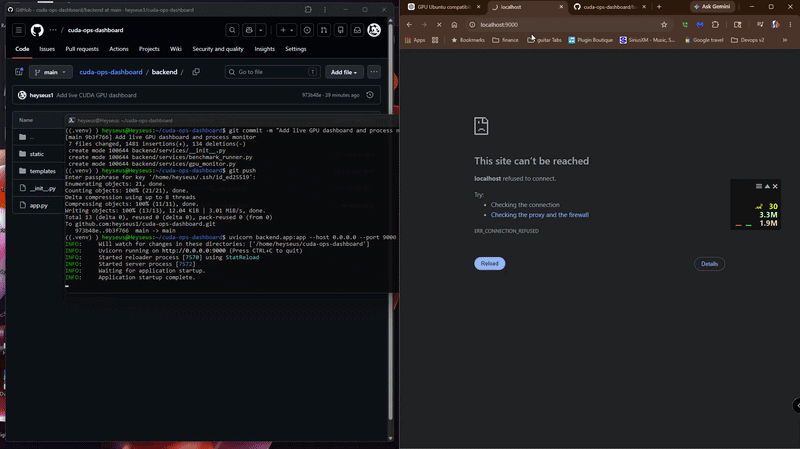

# CUDA Ops Dashboard

A local GPU observability dashboard for monitoring NVIDIA GPU performance in real time while running CUDA workloads.

This project was built on a Windows machine using WSL Ubuntu and an NVIDIA GeForce RTX 3090. It uses FastAPI, PyTorch, NVIDIA Management Library, and a browser-based dashboard to visualize GPU utilization, VRAM usage, temperature, power draw, and benchmark state.

---

## Demo



## Why This Project Exists

Modern AI and infrastructure roles increasingly require practical experience with GPU-backed workloads. This project is designed to demonstrate hands-on understanding of:

- CUDA-enabled GPU workloads
- PyTorch tensor execution on GPU
- NVIDIA GPU telemetry
- GPU memory behavior
- FastAPI backend development
- Live performance visualization
- Local AI/GPU infrastructure concepts

The goal is not just to run a model, but to understand how GPU systems behave while workloads are running.

---

## Current Features

- Live NVIDIA GPU metrics
- Browser-based dashboard
- GPU utilization chart
- VRAM usage chart
- Temperature monitoring
- Power draw monitoring
- CUDA benchmark trigger
- PyTorch matrix multiplication workload
- Benchmark runtime tracking
- CUDA availability detection
- FastAPI API endpoints

---

## Tech Stack

| Layer | Technology |
|---|---|
| OS Environment | Ubuntu on WSL |
| GPU | NVIDIA GeForce RTX 3090 |
| Backend | FastAPI |
| GPU Workload | PyTorch |
| GPU Telemetry | NVIDIA Management Library |
| Frontend | HTML, CSS, JavaScript |
| Charts | Chart.js |
| Runtime | Python 3.12 |

---

## Architecture

```text
Browser Dashboard
        |
        v
FastAPI Backend
        |
        +--> /gpu/metrics
        |       |
        |       +--> NVIDIA Management Library
        |       +--> PyTorch CUDA status
        |
        +--> /gpu/benchmark
                |
                +--> PyTorch CUDA matrix multiplication
                +--> GPU utilization spike
                +--> VRAM allocation
                +--> benchmark runtime update
